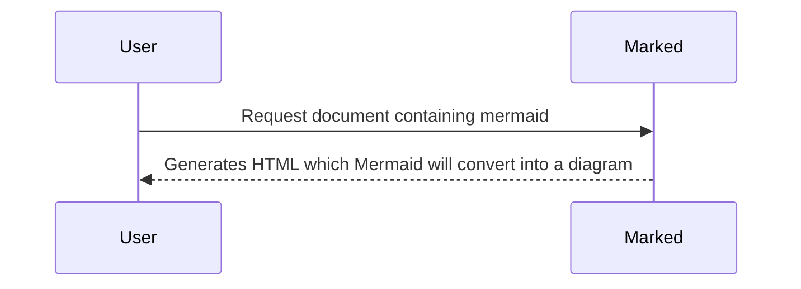

# @MaddyGuthridge/marked-mermaid

A simple Marked extension to render mermaid diagrams.

````md
# Example document


````
<!--
Quadruple backticks for outer code block
https://stackoverflow.com/a/25943045/6335363
-->

Heavily inspired by:

* [marked-mermaid](https://github.com/MichielDeMey/marked-mermaid)
* [dbolack-ab/marked-mermaidjs](https://github.com/dbolack-ab/marked-mermaidjs)

But with up-to-date dependencies (as of November 2025).

* Mermaid 11
* Marked 16-17

Additional notes:

* The diagram will only be rendered in a browser, since the process for
  generating it server-side is [horrific](https://github.com/mermaid-js/mermaid/issues/3650).
  As such, this extension won't work nicely with the `marked` CLI.
* You will need to call `mermaid.run()` manually once the page loads, and again
  whenever your document changes.
* This doesn't attempt to do any fancy memoization, which makes the
  implementation much simpler than alternatives. It's still fast enough for
  real-time editing.

## Usage

```sh
npm i @maddyguthridge/marked-mermaid
```

```js
import { Marked } from 'marked';
import mermaid from 'mermaid';
import markedMermaid from '@maddyguthridge/marked-mermaid';

const marked = new Marked(markedMermaid());

const diagram = [
  '```mermaid',
  'sequenceDiagram',
  '  User->>Marked: Request document containing mermaid',
  '  Marked-->>User: Generates HTML which Mermaid will convert into a diagram',
  '```'
].join('\n');

marked.parse(diagram);
// Mermaid will all documents as soon as it is instructed to do so:
void mermaid.run();
```
